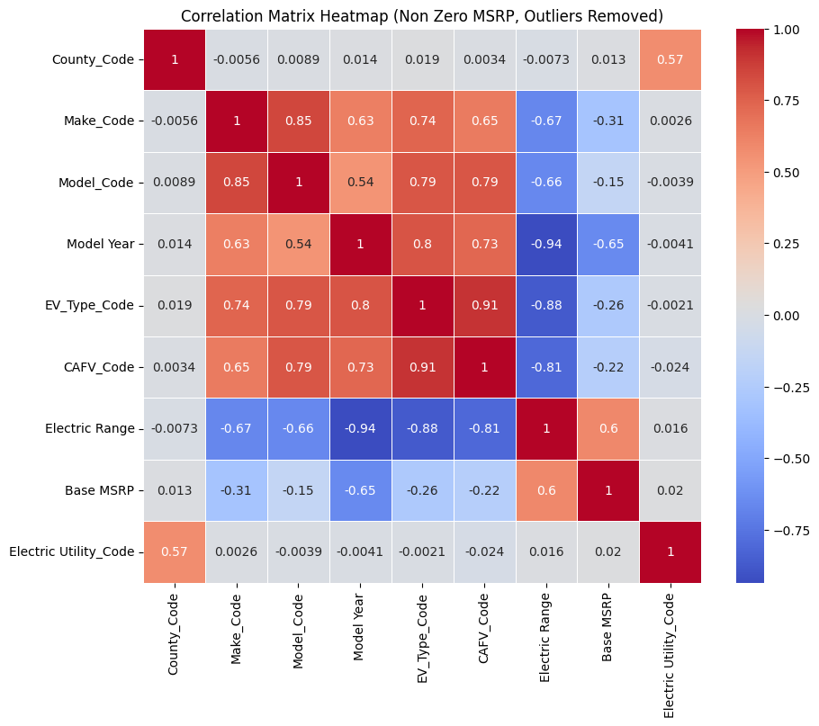
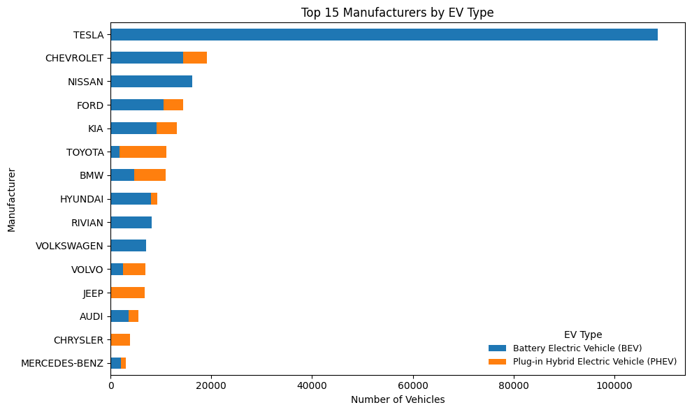
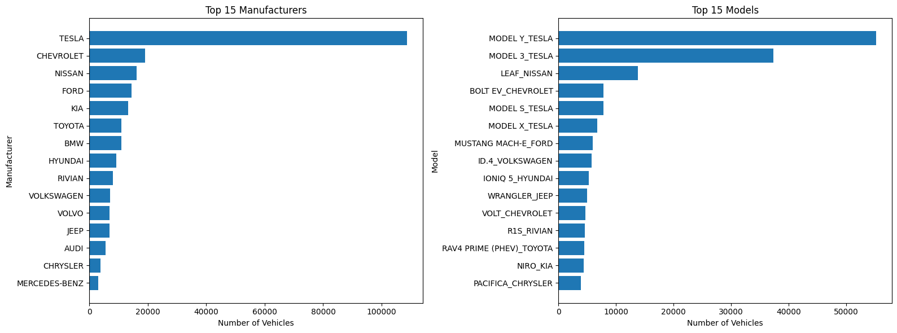
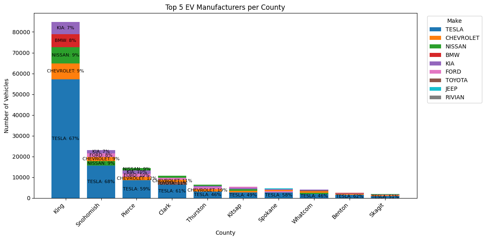
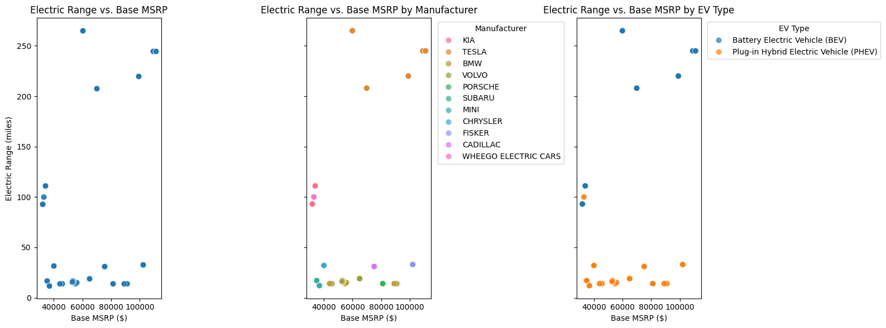
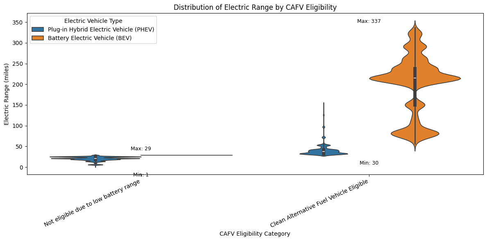

# Electric Vehicle (EV) Adoption Analysis 🚗⚡
Exploratory data analysis of electric vehicle (EV) adoption patterns in Washington State, using Python to uncover geographic, manufacturer, and performance trends that can inform infrastructure planning and policy decisions.

---

## 🎯 Project Objective
The goal of this project is to understand how electric vehicle adoption varies across regions, manufacturers, and vehicle characteristics in Washington State, and to translate data insights into actionable recommendations for stakeholders such as policymakers, utility providers, and businesses.

---

## 📂 Dataset
- **Source:** [Washington State Department of Licensing (DOL) – Electric Vehicle Population Data](https://catalog.data.gov/dataset/electric-vehicle-population-data)
- **Scope:** 260,000+ registered electric vehicles  
- **Key features:**  
  - Vehicle type (BEV vs. PHEV)  
  - Make & model  
  - Model year  
  - Electric range  
  - Base MSRP  
  - County & city  

Each row represents a unique registered electric vehicle.

---

## 🛠️ Tools & Skills
- **Python** (Pandas, NumPy)
- **Exploratory Data Analysis (EDA)**
- **Data cleaning & preprocessing**
- **Data visualization** (Matplotlib, Seaborn)
- **Google Colab & Jupyter Notebook**

---

## 🔍 Analysis Approach
This analysis follows a structured exploratory data analysis process:
- Step 1: **Understand the Problem & Data:** defined research questions and assessed dataset scope and limitations.
- Step 2: **Import & Inspect Data:** reviewed variable types, distributions, and overall data quality.
- Step 3: **Handle Missing Data:** identified missing and zero values (e.g., electric range and base MSRP) and applied appropriate cleaning strategies.
- Step 4: **Explore Data Patterns:** used descriptive statistics and grouped aggregations by geography, manufacturer, vehicle type, and model year.
- Step 5: **Transform Data:** created derived variables and encoded categorical features to support analysis.
- Step 6: **Visualize Relationships & Correlations:** examined key relationships using correlation analysis and visual exploration.
- Step 7: **Handle Outliers:** detected and removed extreme values to avoid distortion in pricing and performance insights.

---

## 📈 Key Insights
- **Battery Electric Vehicles (BEVs) dominate EV adoption**, accounting for the majority of registered electric vehicles.
- **King County and the Seattle area lead EV adoption**, reflecting the influence of higher population density and charging infrastructure availability.
- **Tesla Model Y and Model 3 are the most popular EV models**, indicating strong consumer preference for range and brand recognition.
- **Higher electric range generally corresponds to higher MSRP**, though price is influenced by multiple factors beyond range alone.
- **Utility providers such as Puget Sound Energy serve the largest share of EV owners**, highlighting opportunities for targeted infrastructure investment.

---

## 📊 Visual Highlights

- Correlation matrix used to analyze relationships between key variables

   
  <em>Figure 1. Correlation Matrix</em>

- Top EV Makes and Models

   
  <em>Figure 2. Top 15 EV Makes</em>

   
  <em>Figure 3. Top 15 EV Models</em>

   
  <em>Figure 4. Top 5 EV Makes by County</em>

- Electric Range vs. Price

   
  <em>Figure 5. Electric Range vs. Base MSRP</em>

- Electric Range vs. CAFV Eligibility

   
  <em>Figure 5. Electric Range vs. CAFV Eligibility</em>

---

## ⚠️ Limitations
- The dataset reflects registered vehicles, not actual vehicle usage.
- Recent model years contain incomplete registration and range data.
- Income, charging station availability, and demographic data are not included.

---

## 🚀 Future Work
- Incorporate charging station location data
- Combine EV adoption data with demographic and income statistics
- Build predictive models for future EV adoption trends
- Develop an interactive dashboard for policymakers and planners

---

## Project Files
- [EV_Adoption_Washington_EDA.ipynb](EV_Adoption_Washington_EDA.ipynb) — Main exploratory data analysis notebook
- [EV_Adoption_Washington_EDA.pdf](EV_Adoption_Washington_EDA.pdf) — Project presentation / summary slides
- [README.md](README.md) — Project overview

---

## Author
**Annie Phan**

Data Analyst | MS AI @ San José State University

📫 [LinkedIn](https://www.linkedin.com/in/mophan/) | Portfolio | [Email](mailto:anniephan@gmail.com)
